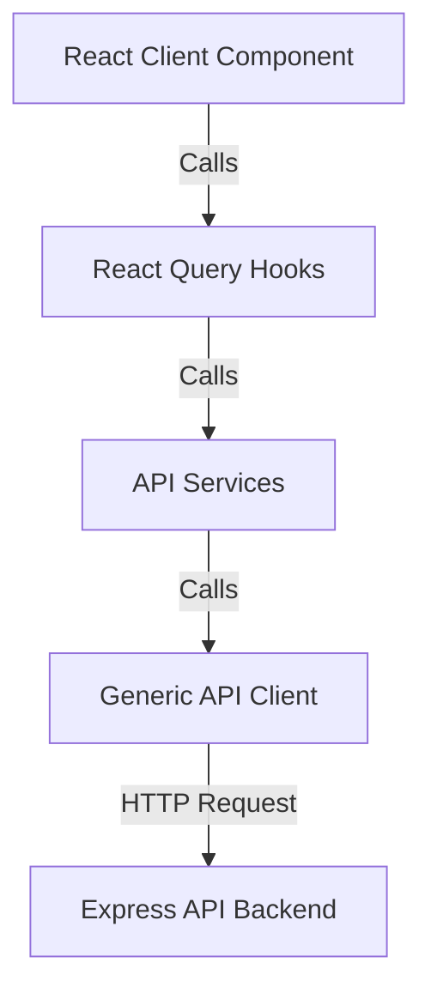

# API Integration & Data Fetching Guide

This document explains the architecture of the data-fetching layer in `apps/web`, how it communicates with the backend `apps/api`, and provides a step-by-step guide for developers to connect new REST API endpoints to frontend components.

---

## 1. Architecture Overview

To maintain clean separation of concerns, type safety, and optimal performance, we follow a 4-layered architecture:



### Layer Descriptions
1. **Types Layer (`types/`)**: Declares TypeScript interfaces for data models, request payloads, and API responses.
2. **Client Layer (`lib/api-client.ts`)**: A wrapper around native `fetch` that automatically configures Base URLs, includes cookies for session authorization, appends active tenant headers, and handles error formatting.
3. **Service Layer (`services/`)**: Consists of modular service modules grouping endpoint calls by feature (e.g., organizations, assets, categories).
4. **Hooks Layer (`hooks/`)**: Wraps service methods with TanStack Query (`useQuery` for reads, `useMutation` for writes) to manage caching, refetching, optimistic updates, and loading states.

---

## 2. Step-by-Step Guide: Connecting a New API Endpoint

Suppose you want to integrate a new feature: **Assets management** (e.g. `GET /assets` and `POST /assets`). Here is how you connect it:

### Step 1: Define TypeScript Types
Create or edit a types file, for example, `types/asset.ts`:

```typescript
// types/asset.ts

export interface Asset {
  id: string
  name: string
  serialNumber: string
  status: 'AVAILABLE' | 'ALLOCATED' | 'UNDER_MAINTENANCE'
  createdAt: string
}

export interface CreateAssetRequest {
  name: string
  serialNumber: string
  status?: string
}

// Backend wraps standard resources inside a success/message envelope
export interface ApiResponse<T> {
  success: boolean
  message?: string
  data: T
}
```

---

### Step 2: Add API Service Method
Create `services/asset.service.ts` to host your fetch requests using the generic `request` client. The client automatically includes the tenant header `x-organization-id` and session authorization cookies:

```typescript
// services/asset.service.ts

import { request } from '../lib/api-client'
import { Asset, CreateAssetRequest, ApiResponse } from '../types/asset'

export const AssetService = {
  // GET request
  async getAssets() {
    const res = await request<ApiResponse<Asset[]>>('/assets')
    return res.data
  },

  // POST request
  async createAsset(data: CreateAssetRequest) {
    const res = await request<ApiResponse<Asset>>('/assets', {
      method: 'POST',
      body: JSON.stringify(data),
    })
    return res.data
  }
}
```

---

### Step 3: Create Custom React Query Hooks
Create `hooks/use-assets.ts` to manage the query lifecycle. You will use `useQuery` for fetching, and `useMutation` for state changes. Always specify query keys for caching and perform automatic refetching on success:

```typescript
// hooks/use-assets.ts

import { useQuery, useMutation, useQueryClient } from '@tanstack/react-query'
import { AssetService } from '../services/asset.service'
import { CreateAssetRequest } from '../types/asset'

export function useAssets() {
  return useQuery({
    queryKey: ['assets'],
    queryFn: () => AssetService.getAssets(),
    staleTime: 1 * 60 * 1000, // Keep data fresh for 1 minute
  })
}

export function useCreateAsset() {
  const queryClient = useQueryClient()
  
  return useMutation({
    mutationFn: (data: CreateAssetRequest) => AssetService.createAsset(data),
    onSuccess: () => {
      // Invalidate the 'assets' cache to trigger an automatic background refetch
      queryClient.invalidateQueries({ queryKey: ['assets'] })
    },
  })
}
```

---

### Step 4: Use Hooks inside Client Components
Now, consume the hooks in your `'use client'` component. The component automatically receives state changes, loading skeletons, and success/error notifications:

```tsx
// app/dashboard/[organizationId]/assets/page.tsx

'use client'

import { useAssets, useCreateAsset } from '@/hooks/use-assets'
import { useState } from 'react'

export default function AssetsPage() {
  const { data: assets, isLoading, error } = useAssets()
  const createMutation = useCreateAsset()
  const [name, setName] = useState('')

  const handleSubmit = async (e: React.FormEvent) => {
    e.preventDefault()
    try {
      await createMutation.mutateAsync({ name, serialNumber: 'SN-' + Date.now() })
      setName('')
      alert('Asset registered successfully!')
    } catch (err) {
      alert(err instanceof Error ? err.message : 'Failed to register asset')
    }
  }

  if (isLoading) return <div>Loading assets...</div>
  if (error) return <div>Error: {error.message}</div>

  return (
    <div className="space-y-6">
      <form onSubmit={handleSubmit} className="flex gap-2">
        <input 
          type="text" 
          value={name} 
          onChange={(e) => setName(e.target.value)} 
          className="border rounded px-2 py-1 bg-white/5 text-white"
          placeholder="New Asset Name"
        />
        <button type="submit" disabled={createMutation.isPending} className="bg-accent px-4 py-2 rounded">
          {createMutation.isPending ? 'Registering...' : 'Add'}
        </button>
      </form>

      <ul className="divide-y divide-white/10">
        {assets?.map((asset) => (
          <li key={asset.id} className="py-2 text-white/80">
            {asset.name} ({asset.status})
          </li>
        ))}
      </ul>
    </div>
  )
}
```

---

## 3. Advanced Features

### A. Multi-Tenant Context Injection
The API Client (`lib/api-client.ts`) handles multi-tenancy transparently:
- It checks if a workspace ID is stored in `sessionStorage` under the key `assetflow:activeOrgId`.
- If found, it appends the header `x-organization-id: <id>` to the request headers.
- The backend middleware (`requireOrganization`) reads this header to restrict database operations to that organization scope.

### B. Session Cookies
Authentication is handled by **Better Auth** using HttpOnly cookies:
- The API Client includes `credentials: 'include'` on every request.
- The browser automatically sends the session cookie with your request, ensuring the user is verified.

### C. Cache Invalidation
When modifying data (e.g. creating, updating, or deleting), call `queryClient.invalidateQueries({ queryKey: [...] })` in the mutation's `onSuccess` block. This forces React Query to refetch related pages in the background, keeping the user interface perfectly up to date without manual page reloads.
