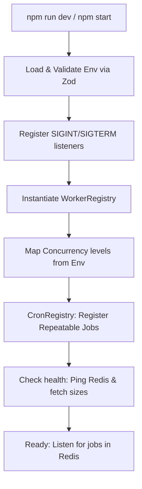

# AssetFlow Background Worker Service Guide

This document provides a comprehensive overview of the design, architecture, and deployment procedures for the AssetFlow Background Worker Service.

---

## 1. Architectural Overview

The Background Worker is a dedicated, isolated service designed to handle asynchronous, CPU-intensive, or delayed tasks without blocking the main API thread.

### System Topologies

#### Startup Lifecycle


#### Job Execution Pipeline
```mermaid
sequenceDiagram
  participant App as API Server / App Code
  participant Redis as Redis Backend
  participant Worker as BullMQ Worker
  participant Proc as Domain Processor (e.g., NotificationProcessor)
  participant Service as Domain Service (e.g., NotificationService)

  App->>Redis: Enqueue via QueueRegistry (e.g., sendEmail)
  Redis->>Worker: Pulls Job (FIFO/delayed check)
  Worker->>Proc: process(job)
  Note over Proc: Contextual logs + start timer
  Proc->>Proc: Route to Job-Name handler
  Proc->>Service: Call business logic
  Service-->>Proc: Resolve / Reject
  Note over Proc: Logs duration, status, sizes
  Proc-->>Worker: Done / Fail
  
  alt Job Threw Error
    Worker->>Redis: Schedule retry (Exponential Backoff)
  else Max Attempts Reached
    Worker->>Redis: Move to Failed state (DLQ Inspection)
  </td>
```

---

## 2. Folder Structure

```
apps/worker/
├── src/
│   ├── config/             # Zod environment parsing and strict validation
│   ├── constants/          # Constants for queue names and job actions
│   ├── cron/               # Repeatable cron job schedules
│   ├── lib/                # Database and Redis clients
│   ├── logger/             # Winston/Pino structured JSON log setup
│   ├── processors/         # BullMQ Workers and routing handlers
│   ├── queues/             # Strongly-typed wrappers for enqueuing jobs
│   ├── services/           # Decoupled business logic (e.g. notifications)
│   ├── types/              # TS interface contracts for payloads
│   ├── utils/              # Graceful shutdown, telemetry, and metrics
│   └── index.ts            # Service bootloader entry point
├── .env.example            # Environment variables template
├── eslint.config.js        # Workspace linting definitions
├── package.json            # Monorepo dependencies and build scripts
└── tsconfig.json           # Compiler rules extending workspace default
```

---

## 3. Core Concepts

### Redis Connections
The connection configuration in [`src/lib/redis.ts`](file:///e:/Hackathon/Odoo-2026/asset-flow/apps/worker/src/lib/redis.ts) is shared between all queues and workers. 
> [!IMPORTANT]
> BullMQ requires `maxRetriesPerRequest` to be set to `null` on its Redis client. This is because BullMQ uses blocking commands (`BRPOPLPUSH`) to fetch jobs, and letting the Redis driver reconnect and retry requests automatically during a block disrupts job lock state tracking.

### Error Handling & Retries
Every queue inherits standard default job options from the [`BaseQueue`](file:///e:/Hackathon/Odoo-2026/asset-flow/apps/worker/src/queues/base.queue.ts):
- **Attempts**: Default is `3`.
- **Backoff**: Exponential backoff strategy starting at `2000`ms (e.g., attempt 1 fails $\rightarrow$ wait 2s $\rightarrow$ attempt 2 fails $\rightarrow$ wait 4s $\rightarrow$ attempt 3 fails $\rightarrow$ wait 8s).
- **Graceful Failure**: Exceptions thrown inside processors are logged with their stack traces and re-thrown to BullMQ. The worker process itself never crashes on job errors.

### Job Expiration & Memory Tuning
To prevent memory leaks in Redis, completed and failed jobs are automatically pruned from memory:
- **Completed**: Kept for 24 hours, capped at a maximum of `1000` jobs.
- **Failed**: Kept for 7 days, capped at `5000` jobs. This serves as a Dead Letter Queue (DLQ), allowing developers to inspect payloads and stack traces of failed jobs via a CLI or Redis GUI.

### Logging
We use [Pino](https://github.com/pinojs/pino) for structured JSON logs in production. In local development, the transport outputs clean, colorized, readable CLI lines. Every job run outputs the following structured fields:
`jobId`, `queueName`, `jobName`, `retryCount`, `payloadSizeBytes`, `durationMs`, and `success` (true/false).

### Graceful Shutdown
When receiving `SIGTERM` or `SIGINT` (e.g. from Kubernetes, Docker, or Ctrl+C):
1. The cron scheduler cancels scheduled Repeatable timers to prevent new triggers.
2. The workers close their poll cycles (stops taking new jobs, but finishes current active jobs).
3. The connection pool waits up to `30s` (configured in `WorkerRegistry`) for active jobs to complete.
4. Redis connections are closed, and the process exits with status `0`.

---

## 4. Scaling Horizontally

When deploying multiple instances of the worker service, keep the following in mind:

### Worker Behavior
BullMQ workers lock jobs when processing them. If you run 5 worker containers:
- Only one container will process any given job instance.
- Jobs are distributed round-robin/first-available style.
- Concurrency levels (e.g. `CONCURRENCY_NOTIFICATION=10`) are **per container instance**.

### Repeatable Cron Jobs
BullMQ coordinates repeatable jobs using Redis. If you have 5 workers running:
- **Only one** container triggers the job at the scheduled cron interval.
- However, to avoid duplicate registration and Redis locks during service restarts, set `CRON_ENABLED=false` on replicas, and keep it `true` on only one primary deployment coordinator (or allow BullMQ to handle it, but keeping it off on replicas decreases load).

### Idempotency
Because jobs can fail and retry, **every processor must be idempotent**. If a job fails halfway through, the retry will start from the beginning. 
- *Check-then-act*: Always verify the database state before committing actions (e.g., check if a maintenance ticket is already complete before sending the reminder email).
- *Unique Keys*: Use unique transaction hashes or business record IDs (like `bookingId`) as the BullMQ `jobId` to automatically discard duplicates.

---

## 5. Guide: Adding a New Background Task

Follow this step-by-step checklist to introduce a new background job into the system.

### Step 1: Create Payload Interface
Open [`src/types/job.types.ts`](file:///e:/Hackathon/Odoo-2026/asset-flow/apps/worker/src/types/job.types.ts) and add the TypeScript interface for your new job's payload.

```typescript
export interface ProcessAssetDecommissionPayload {
  assetId: string;
  reason: string;
  requestedBy: string;
  decommissionDate: string;
}
```

### Step 2: Declare Constants
Create unique job name keys in [`src/constants/jobs.ts`](file:///e:/Hackathon/Odoo-2026/asset-flow/apps/worker/src/constants/jobs.ts).

```typescript
export const JOBS = {
  // ... existing
  MAINTENANCE: {
    // ...
    DECOMMISSION_ASSET: "decommission-asset",
  }
}
```

### Step 3: Create Queue Helper Method
Open the relevant queue wrapper (e.g., [`src/queues/maintenance.queue.ts`](file:///e:/Hackathon/Odoo-2026/asset-flow/apps/worker/src/queues/maintenance.queue.ts)) and expose a semantic method.

```typescript
import { ProcessAssetDecommissionPayload } from "../types/job.types.js";

// Inside class MaintenanceQueue
public async decommissionAsset(
  assetId: string,
  reason: string,
  requestedBy: string,
  decommissionDate: string,
  opts?: JobsOptions
) {
  const payload: ProcessAssetDecommissionPayload = { assetId, reason, requestedBy, decommissionDate };
  return this.addJob(JOBS.MAINTENANCE.DECOMMISSION_ASSET, payload, opts);
}
```

### Step 4: Write Processor Handler
Open the corresponding processor file (e.g. [`src/processors/maintenance.processor.ts`](file:///e:/Hackathon/Odoo-2026/asset-flow/apps/worker/src/processors/maintenance.processor.ts)). 
1. Bind the job name constant to a private handler method in the `handlers` record.
2. Implement the private method.

```typescript
// Inside class MaintenanceProcessor
protected handlers = {
  // ... existing handlers
  [JOBS.MAINTENANCE.DECOMMISSION_ASSET]: this.handleDecommissionAsset,
};

private async handleDecommissionAsset(job: Job<ProcessAssetDecommissionPayload>): Promise<void> {
  const { assetId, reason, requestedBy } = job.data;
  
  // Implement decommissioning database writes, API calls, or triggers
  logger.info({ assetId, requestedBy }, "Decommissioning asset and updating stock counts...");
  
  // Example DB transaction
  await db.asset.update({
    where: { id: assetId },
    data: { status: "DECOMMISSIONED", decommissionReason: reason }
  });
}
```

### Step 5: Trigger from the API
You do not need to register the processor manually. The [`WorkerRegistry`](file:///e:/Hackathon/Odoo-2026/asset-flow/apps/worker/src/processors/registry.ts) automatically hooks it up because it imports and mounts the `MaintenanceProcessor` singleton.

In your Express controller or API route:
```typescript
import { QueueRegistry } from "../../worker/src/queues/registry.js";

export async function decommissionController(req: Request, res: Response) {
  const { assetId, reason, userId } = req.body;
  
  // Enqueue job. It returns immediately and will execute in the background.
  await QueueRegistry.maintenance.decommissionAsset(
    assetId,
    reason,
    userId,
    new Date().toISOString()
  );
  
  return res.json({ success: true, message: "Asset decommissioning scheduled" });
}
```

---

## 6. Implementation Examples

### Enqueueing a Delayed Job
Run a task after a specific duration (e.g., send a checkout reminder 3 days from now).
```typescript
// delay of 3 days in milliseconds
const THREE_DAYS_MS = 3 * 24 * 60 * 60 * 1000;

await QueueRegistry.maintenance.scheduleReminder(
  "asset-777",
  "maint-902",
  new Date().toISOString(),
  "engineer@company.com",
  "Scheduled Calibrations",
  { delay: THREE_DAYS_MS } // BullMQ Job Option
);
```

### Scheduling a Recurring Job
Configure a cron timer in [`src/cron/registry.ts`](file:///e:/Hackathon/Odoo-2026/asset-flow/apps/worker/src/cron/registry.ts):
```typescript
{
  queue: QueueRegistry.maintenance,
  jobName: JOBS.MAINTENANCE.CHECK_OVERDUE_RETURNS,
  payload: { checkThresholdDays: 14 },
  cronExpression: "0 0 * * 0", // Every Sunday at midnight
  description: "Weekly audit for overdue checkouts"
}
```

### Adding Bulk Jobs
Perform multiple enqueues in a single optimized Redis round-trip transaction.
```typescript
await QueueRegistry.notification.bulkAdd([
  {
    name: "send-email",
    data: {
      type: "email",
      data: { to: "user1@domain.com", subject: "A", template: "temp", context: {} }
    }
  },
  {
    name: "send-email",
    data: {
      type: "email",
      data: { to: "user2@domain.com", subject: "B", template: "temp", context: {} }
    }
  }
]);
```

### Cancelling a Repeatable Job
Remove a registered cron schedule from Redis.
```typescript
await QueueRegistry.maintenance.cancelRepeatable(
  JOBS.MAINTENANCE.CHECK_OVERDUE_RETURNS,
  "0 * * * *" // Must match the exact cron pattern it was registered with
);
```

### Inspecting & Retrying Failed Jobs
If a job exceeds all retry counts, it moves to the `failed` state. You can recover it by writing a script or using a BullMQ manager dashboard (like Bull-Board) to call:
```typescript
const job = await queue.getJob("job-id");
if (job) {
  await job.retry(); // Re-queues the job for execution
}
```

---

## 7. Local Development & Debugging

### Setup
1. Duplicate `.env.example` as `.env`.
2. Start local Redis:
   ```bash
   docker run -d --name redis-local -p 6379:6379 redis:alpine
   ```
3. Start the worker in development mode (hot-reloads on edits):
   ```bash
   npm run dev --workspace=worker
   ```

### Debugging Stuck Jobs
If jobs are not executing:
1. Call `checkHealth()` (via index start logs or a custom endpoint) to inspect the Redis connectivity flag.
2. Verify that the prefix namespace (`QUEUE_PREFIX`) matches exactly on both the API enqueuer and the worker consumer.
3. Check the active job count: if a job is in `active` state but nothing prints, ensure the worker concurrency is not saturated and that handlers are resolving their Promises (a handler with an unresolved promise blocks further execution on that worker thread).
