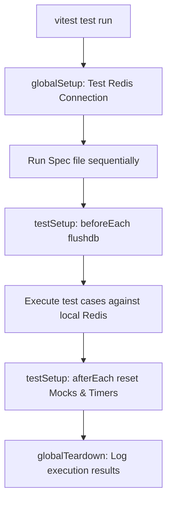

# AssetFlow Worker Service Testing Guide

This guide provides a comprehensive breakdown of the testing infrastructure, strategies, and execution commands configured for the AssetFlow Background Worker Service.

---

## 1. Testing Architecture

The worker's testing infrastructure is designed to run in isolation from the runtime source code, utilizing **Vitest** for fast, native ECMAScript Modules (ESM) support.



### Key Decisions
*   **Sequential Execution**: Because the worker tests write to and read from a shared database (Redis), tests are run sequentially (`sequence: { concurrent: false }` in [`vitest.config.ts`](file:///e:/Hackathon/Odoo-2026/asset-flow/apps/worker/vitest.config.ts)) to prevent race conditions during DB cleanup.
*   **Automatic Redis Flushing**: A fresh Redis state is guaranteed for every single test file. The global setup verifies Redis is online, and `beforeEach` in [`testSetup.ts`](file:///e:/Hackathon/Odoo-2026/asset-flow/apps/worker/tests/setup/testSetup.ts) flushes all database keys.

---

## 2. Folder Structure

All test resources are located in `apps/worker/tests/`:
```
apps/worker/tests/
├── cron/                       # Cron repeatable job tests
├── fixtures/                   # Enterprise mock data models
│   └── enterprise.fixtures.ts
├── helpers/                    # Shared test execution helpers
│   └── worker.helper.ts
├── integration/                # SMTP, Redis and Worker lifecycle tests
│   ├── redis.spec.ts
│   ├── smtp.spec.ts
│   └── worker.spec.ts
├── mocks/                      # In-memory notification channel spy mocks
│   └── smtp.mock.ts
├── performance/                # Concurrency & latency benchmarks
│   └── performance.spec.ts
├── processors/                 # Processor routing and error unit tests
│   └── processor.spec.ts
├── queues/                     # Queue enqueuing, priority, and deduplication specs
│   └── queue.spec.ts
├── services/                   # Service layer unit tests
│   └── notification.spec.ts
├── setup/                      # Vitest environment hooks
│   ├── globalSetup.ts
│   ├── globalTeardown.ts
│   └── testSetup.ts
└── TESTING_GUIDE.md            # This document
```

---

## 3. How to Run Tests

From the monorepo root (using `npm` workspace flags):

### Run All Tests
```bash
npm test -w worker
```

### Run Specific Suites
*   **Unit Tests only**: `npm run test:unit -w worker`
*   **Integration Tests only**: `npm run test:integration -w worker`
*   **End-to-End Worker Lifecycle**: `npm run test:e2e -w worker`
*   **Performance Benchmarks**: `npm run test:performance -w worker`
*   **Queue Specs**: `npm run test:queues -w worker`
*   **Notification Specs**: `npm run test:notifications -w worker`
*   **Cron Specs**: `npm run test:cron -w worker`

### Watch Mode (Hot-Reload)
```bash
npm run test:watch -w worker
```

### Generate Coverage Reports
```bash
npm run test:coverage -w worker
```
Coverage files are output as standard HTML cards under `apps/worker/coverage/index.html`.

---

## 4. SMTP / Email Integration Testing

The integration test suite ([`tests/integration/smtp.spec.ts`](file:///e:/Hackathon/Odoo-2026/asset-flow/apps/worker/tests/integration/smtp.spec.ts)) is configured to target a real testing email address: **`shindearyan179@gmail.com`**.

### How it behaves:
1.  **With Environment Settings**: If `SMTP_HOST`, `SMTP_USER`, and `SMTP_PASS` are defined in the environment (read via `.env`), the tests will connect to the external SMTP mail server, authenticate, render templates, and dispatch actual emails to `shindearyan179@gmail.com`.
2.  **Mock Fallback**: If those variables are omitted or empty, the tests automatically catch the missing credentials and mock the SMTP delivery layer, printing warning logs while verifying queue states, retry configs, and payload formats. This prevents local builds or CI pipelines from failing due to missing credentials.

---

## 5. Adding New Tests

### Testing a New Queue Method
1.  Identify the payload type inside `src/types/job.types.ts`.
2.  Open [`tests/queues/queue.spec.ts`](file:///e:/Hackathon/Odoo-2026/asset-flow/apps/worker/tests/queues/queue.spec.ts).
3.  Add an assertion block checking that the enqueuer correctly sets the payload type, schedules delayed timers, and applies options.

```typescript
it("should verify decommissioning assets enqueues with correct parameters", async () => {
  const job = await QueueRegistry.maintenance.decommissionAsset(
    "asset-99", "Wear and tear", "admin-1", new Date().toISOString()
  );
  expect(job.name).toBe(JOBS.MAINTENANCE.DECOMMISSION_ASSET);
  expect(job.data.reason).toBe("Wear and tear");
});
```

### Testing a New Processor Handler
Unit test your processor without running a Redis instance by instantiating the class directly and passing a mock job object.

1.  Open [`tests/processors/processor.spec.ts`](file:///e:/Hackathon/Odoo-2026/asset-flow/apps/worker/tests/processors/processor.spec.ts).
2.  Inside the corresponding `describe` block (e.g. `MaintenanceProcessor`), mock any downstream services.
3.  Invoke `.process(mockJob)` and assert on mock calls.

```typescript
it("should execute decommissioning updates on db", async () => {
  const mockJob = createMockJob(
    JOBS.MAINTENANCE.DECOMMISSION_ASSET,
    { assetId: "asset-99", reason: "Scrapped" },
    QUEUES.MAINTENANCE
  );
  
  const dbSpy = vi.spyOn(db.asset, "update").mockResolvedValue({} as any);
  const processor = new MaintenanceProcessor();

  await processor.process(mockJob);

  expect(dbSpy).toHaveBeenCalledWith(expect.objectContaining({
    where: { id: "asset-99" },
    data: { status: "DECOMMISSIONED" }
  }));
});
```

---

## 6. Debugging Failed Tests

*   **View Worker Logs**: If a test hangs or fails unexpectedly, run the test with `DEBUG_TESTS=true` to enable Pino output logs in the terminal.
    ```bash
    DEBUG_TESTS=true pnpm --filter worker test
    ```
*   **Stuck/Hanging Tests**: Check that your processors return resolved/rejected promises. If a processor leaves a promise pending indefinitely, the worker remains active, causing the test timeout (`10000ms`) to trigger.
*   **Flaky Assertions**: Ensure that you use the wait helpers from [`tests/helpers/worker.helper.ts`](file:///e:/Hackathon/Odoo-2026/asset-flow/apps/worker/tests/helpers/worker.helper.ts) (like `waitForJobState` or `waitForQueueCount`) instead of static timeouts like `setTimeout(resolve, 2000)`. BullMQ queues process asynchronously and duration timings can fluctuate based on local CPU loads.
